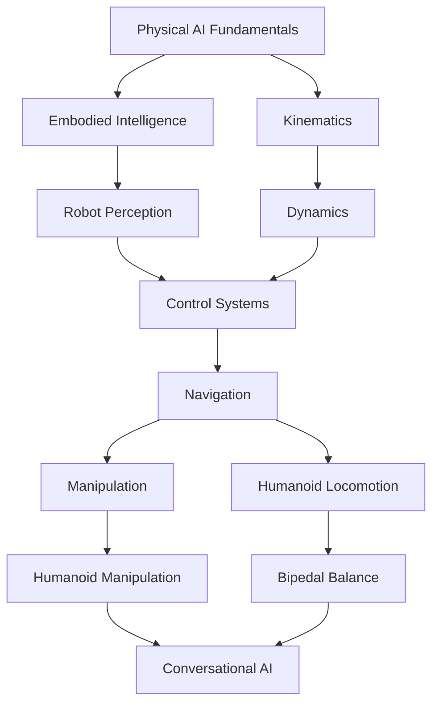

## Prerequisite Detection and Recommendation System

The Physical_Humanoid_AI_Robotics_Course includes an intelligent system to detect knowledge gaps and recommend appropriate prerequisite content based on your current understanding and learning goals.

### How It Works

Our system evaluates your current knowledge level through:
1. Initial assessment upon enrollment
2. Continuous evaluation during course progress
3. Performance on exercises and projects
4. Self-reported experience levels

Based on this evaluation, the system recommends:
- Prerequisite modules to strengthen weak areas
- Supplementary content for deeper understanding
- Alternative learning paths based on your progress
- Additional practice exercises for challenging concepts

### Knowledge Graph

Our system uses a knowledge graph that maps the relationships between different concepts in the course:



### Initial Assessment

When you start the course, you'll take an initial assessment to determine your baseline knowledge:

#### Technical Skills Assessment
- Programming experience (Python, C++, etc.)
- Mathematics background (linear algebra, calculus, statistics)
- Robotics familiarity (ROS, control systems, etc.)
- AI/ML knowledge (neural networks, reinforcement learning, etc.)

#### Learning Goals Assessment
- Professional goals (career advancement, research, etc.)
- Interest areas (perception, control, interaction, etc.)
- Time commitment available
- Preferred learning style

### Continuous Evaluation

The system continuously monitors your progress and identifies areas where you might need additional support:

1. **Quiz Performance**: If you struggle with kinematics concepts, we recommend reviewing foundational mathematics
2. **Exercise Difficulty**: If you're spending significantly more time on certain modules, we suggest additional practice
3. **Pattern Recognition**: The system recognizes learning patterns and adapts recommendations accordingly

### Recommendation Algorithms

Our system uses several algorithms to provide personalized recommendations:

#### Content-Based Filtering
Recommendations based on the content and skills required for each module compared to your assessed abilities.

#### Collaborative Filtering
Recommendations based on what similar learners found helpful for the same concepts.

#### Knowledge Tracing
Models your knowledge state over time and predicts which concepts you're likely to struggle with.

### Implementation Example

Here's how the recommendation system works behind the scenes:

```typescript
interface UserProfile {
  userId: string;
  technicalSkills: {
    programming: number; // 1-5 scale
    mathematics: number;
    robotics: number;
    ai_ml: number;
  };
  learningGoals: string[];
  timeAvailability: 'low' | 'medium' | 'high';
  preferredLearningStyle: 'visual' | 'hands-on' | 'theoretical';
}

interface CourseModule {
  moduleId: string;
  title: string;
  prerequisites: string[];
  difficulty: number; // 1-5 scale
  estimatedTime: number; // hours
  skillsRequired: string[];
}

interface KnowledgeGraph {
  concepts: Map<string, ConceptNode>;
  relationships: Map<string, string[]>; // Maps concept to prerequisites
}

interface Recommendation {
  moduleId: string;
  reason: string;
  confidence: number; // 0-1
  priority: 'high' | 'medium' | 'low';
}

class PrerequisiteDetector {
  private userProfile: UserProfile;
  private knowledgeGraph: KnowledgeGraph;
  
  constructor(userProfile: UserProfile) {
    this.userProfile = userProfile;
    this.knowledgeGraph = this.buildKnowledgeGraph();
  }
  
  detectPrerequisites(moduleId: string): Recommendation[] {
    const module = this.getCourseModule(moduleId);
    const recommendations: Recommendation[] = [];
    
    // Check each prerequisite
    for (const prereq of module.prerequisites) {
      const prereqLevel = this.assessPrereqLevel(prereq);
      const requiredLevel = this.getRequiredLevel(prereq, moduleId);
      
      if (prereqLevel < requiredLevel) {
        const gap = requiredLevel - prereqLevel;
        const confidence = this.calculateConfidence(prereq, gap);
        
        recommendations.push({
          moduleId: prereq,
          reason: `Prerequisite for ${module.title}. Your level: ${prereqLevel}, required: ${requiredLevel}`,
          confidence,
          priority: this.determinePriority(gap, confidence)
        });
      }
    }
    
    // Sort by priority and confidence
    return recommendations.sort((a, b) => {
      const priorityOrder = { high: 3, medium: 2, low: 1 };
      if (priorityOrder[a.priority] !== priorityOrder[b.priority]) {
        return priorityOrder[b.priority] - priorityOrder[a.priority];
      }
      return b.confidence - a.confidence;
    });
  }
  
  private assessPrereqLevel(concept: string): number {
    // This would integrate with the user's assessment data
    // and possibly infer knowledge from completed modules
    return this.estimateKnowledgeLevel(concept);
  }
  
  private estimateKnowledgeLevel(concept: string): number {
    // Implementation would consider:
    // - Initial assessment scores
    // - Performance on related exercises
    // - Time spent on related content
    // - Self-reported expertise
    return 3; // Placeholder
  }
  
  private calculateConfidence(prereq: string, gap: number): number {
    // Calculate confidence based on available data
    // More data points = higher confidence
    return Math.min(1.0, 0.5 + (gap * 0.15));
  }
  
  private determinePriority(gap: number, confidence: number): 'high' | 'medium' | 'low' {
    if (gap >= 2 && confidence >= 0.7) return 'high';
    if (gap >= 1 && confidence >= 0.6) return 'medium';
    return 'low';
  }
  
  private buildKnowledgeGraph(): KnowledgeGraph {
    // Build knowledge graph from course structure
    return {
      concepts: new Map(),
      relationships: new Map()
    };
  }
  
  private getCourseModule(moduleId: string): CourseModule {
    // Retrieve module information
    return {
      moduleId,
      title: 'Placeholder',
      prerequisites: [],
      difficulty: 3,
      estimatedTime: 4,
      skillsRequired: []
    };
  }
  
  private getRequiredLevel(concept: string, forModule: string): number {
    // Determine required level based on module difficulty
    // and the importance of the prerequisite
    return 3; // Placeholder
  }
}

// Usage example
const detector = new PrerequisiteDetector(userProfile);
const recommendations = detector.detectPrerequisites('week-11-humanoid-robotics');
```

### Adaptive Learning Path Adjustment

Based on the detected prerequisites, the system can:

1. **Adjust Learning Path**: Recommend a different path if fundamental gaps are detected
2. **Suggest Interim Modules**: Insert bridging content between modules
3. **Provide Supplementary Resources**: Offer additional readings or exercises
4. **Modify Pace**: Adjust the recommended time commitment based on your progress

### Example Scenarios

#### Scenario 1: Programming Gap Detected
If the system detects you're struggling with ROS 2 programming concepts, it might recommend:
- Additional Python/C++ tutorials
- ROS 2 fundamentals refresher
- Extra practice exercises
- Peer mentoring session

#### Scenario 2: Mathematics Gap Detected
If you're having difficulty with kinematics calculations, the system might suggest:
- Linear algebra refresher
- Trigonometry review
- Interactive kinematics visualizations
- Step-by-step problem solving guides

#### Scenario 3: Advanced Learner
For users who demonstrate mastery of concepts quickly, the system might:
- Recommend accelerated learning path
- Provide advanced supplementary content
- Suggest research projects
- Connect with advanced peers for collaboration

### Privacy and Data Usage

We take your learning data seriously:
- All assessment data is stored securely
- Data is only used to improve your learning experience
- You can opt-out of personalized recommendations
- Data is never shared with third parties
- You can request deletion of your learning data at any time

### Getting Started

To benefit from our prerequisite detection and recommendation system:

1. Complete the initial assessment when prompted
2. Engage honestly with exercises and assessments
3. Update your profile if your circumstances change
4. Provide feedback on recommendations to improve the system

The system will automatically adapt to your learning patterns and provide increasingly accurate recommendations over time.