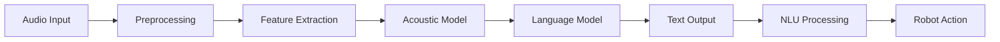

## Learning Objectives

- Understand automatic speech recognition (ASR) principles for robotics
- Implement natural language understanding (NLU) for robot commands
- Integrate speech recognition with robot action systems
- Design robust speech processing pipelines
- Handle noise and environmental challenges in robotic applications
- Evaluate speech recognition performance in real-world scenarios

## Introduction

Speech recognition and Natural Language Understanding (NLU) are critical components for natural human-robot interaction. In robotics applications, these technologies enable robots to understand and respond to human voice commands, facilitating intuitive interaction without requiring physical interfaces or pre-programmed gestures.

Robotic speech recognition systems face unique challenges compared to conventional speech recognition:
- Noisy environments with robot motor sounds
- Variable acoustic conditions
- Real-time processing requirements
- Integration with robot control systems
- Safety considerations for action execution

## Automatic Speech Recognition (ASR) in Robotics

### ASR Fundamentals

Automatic Speech Recognition (ASR) converts spoken language into text. For robotics applications, ASR systems must be robust to environmental conditions and provide low-latency responses.

### Popular ASR Systems for Robotics

1. **Google Speech-to-Text API**: Highly accurate cloud-based solution
2. **Mozilla DeepSpeech**: Open-source on-premise solution
3. **Vosk**: Lightweight offline ASR
4. **CMU Sphinx**: Traditional HMM-based approach
5. **Whisper**: OpenAI's general-purpose speech recognition model

### ASR Pipeline for Robotics



### Example: Basic ASR Implementation

```python
import speech_recognition as sr
import threading
import queue
import time

class RobotSpeechRecognition:
    def __init__(self):
        self.recognizer = sr.Recognizer()
        self.microphone = sr.Microphone()
        
        # Adjust for ambient noise
        with self.microphone as source:
            self.recognizer.adjust_for_ambient_noise(source)
        
        # Set energy threshold for silence detection
        self.recognizer.energy_threshold = 400
        
        # Create queues for thread communication
        self.audio_queue = queue.Queue()
        self.result_queue = queue.Queue()
        
        # Audio processing thread
        self.processing_thread = None
        self.is_listening = False
        
    def start_continuous_listening(self):
        """
        Start continuous listening for speech input
        """
        def audio_callback(recognizer, audio):
            try:
                # Recognize speech using Google Web Speech API
                text = recognizer.recognize_google(audio)
                self.result_queue.put({
                    'text': text,
                    'timestamp': time.time()
                })
            except sr.UnknownValueError:
                # Speech was detected but not understood
                self.result_queue.put({
                    'text': None,
                    'error': 'Unintelligible speech',
                    'timestamp': time.time()
                })
            except sr.RequestError as e:
                # API error
                self.result_queue.put({
                    'text': None,
                    'error': f'API error: {str(e)}',
                    'timestamp': time.time()
                })
        
        # Start listening in background
        self.stop_listening = self.recognizer.listen_in_background(
            self.microphone, 
            audio_callback
        )
        
        self.is_listening = True
        print("Started continuous listening...")
    
    def stop_listening(self):
        """
        Stop the continuous listening
        """
        if self.is_listening:
            self.stop_listening(wait_for_stop=False)
            self.is_listening = False
            print("Stopped continuous listening")
    
    def get_latest_result(self):
        """
        Get the latest recognition result
        """
        try:
            return self.result_queue.get_nowait()
        except queue.Empty:
            return None
```

## Natural Language Understanding (NLU)

### NLU Fundamentals

Natural Language Understanding (NLU) extracts meaning from natural language input. In robotics, NLU interprets user commands and determines appropriate robot actions.

### NLU Components for Robotics

1. **Intent Recognition**: Identifying the user's intended action
2. **Entity Extraction**: Identifying objects, locations, and parameters
3. **Context Management**: Maintaining conversation state
4. **Action Mapping**: Converting NLU output to robot commands

### Example: NLU Implementation

```python
import spacy
import re
from typing import Dict, List, Tuple

class RobotNLU:
    def __init__(self):
        # Load spaCy model for English
        try:
            self.nlp = spacy.load("en_core_web_sm")
        except OSError:
            print("spaCy model not found. Install with: python -m spacy download en_core_web_sm")
            self.nlp = None
        
        # Define robot intents
        self.intents = {
            'navigation': {
                'patterns': [
                    r'.*go to (.+)',
                    r'.*move to (.+)',
                    r'.*navigate to (.+)',
                    r'.*go (.+)',
                    r'.*move (.+)'
                ],
                'action': 'navigate_to'
            },
            'manipulation': {
                'patterns': [
                    r'.*pick up (.+)',
                    r'.*grasp (.+)',
                    r'.*take (.+)',
                    r'.*lift (.+)',
                    r'.*hold (.+)'
                ],
                'action': 'manipulate'
            },
            'greeting': {
                'patterns': [
                    r'^(hello|hi|hey|good morning|good afternoon|good evening)$',
                    r'^greetings$'
                ],
                'action': 'greet'
            },
            'information_request': {
                'patterns': [
                    r'.*what is your name',
                    r'.*who are you',
                    r'.*tell me about yourself',
                    r'.*what can you do',
                    r'.*what are your capabilities'
                ],
                'action': 'provide_info'
            }
        }
    
    def process_text(self, text: str) -> Dict:
        """
        Process text input and extract intent and entities
        """
        text_lower = text.lower().strip()
        
        # Identify intent
        intent = self.identify_intent(text_lower)
        
        # Extract entities
        entities = self.extract_entities(text)
        
        # Generate robot command
        command = self.generate_command(intent, entities, text)
        
        return {
            'text': text,
            'intent': intent,
            'entities': entities,
            'command': command,
            'confidence': 0.8  # Placeholder confidence
        }
    
    def identify_intent(self, text: str) -> str:
        """
        Identify the intent of the user's request
        """
        for intent_name, intent_data in self.intents.items():
            for pattern in intent_data['patterns']:
                if re.match(pattern, text):
                    return intent_name
        
        return 'unknown'
    
    def extract_entities(self, text: str) -> Dict:
        """
        Extract named entities from text
        """
        if not self.nlp:
            return {}
        
        doc = self.nlp(text)
        
        entities = {
            'objects': [],
            'locations': [],
            'persons': [],
            'quantities': []
        }
        
        for ent in doc.ents:
            if ent.label_ == 'GPE' or ent.label_ == 'LOC':  # Geographic/Location
                entities['locations'].append(ent.text)
            elif ent.label_ == 'PERSON':  # Person names
                entities['persons'].append(ent.text)
            elif ent.label_ == 'MONEY' or ent.label_ == 'QUANTITY':  # Quantities
                entities['quantities'].append(ent.text)
            else:
                entities['objects'].append(ent.text)
        
        return entities
    
    def generate_command(self, intent: str, entities: Dict, original_text: str) -> Dict:
        """
        Generate robot command based on intent and entities
        """
        if intent == 'navigation':
            location = entities['locations'][0] if entities['locations'] else 'unknown'
            return {
                'action': 'navigate_to',
                'parameters': {
                    'destination': location,
                    'original_request': original_text
                }
            }
        
        elif intent == 'manipulation':
            obj = entities['objects'][0] if entities['objects'] else 'unknown'
            return {
                'action': 'manipulate',
                'parameters': {
                    'object': obj,
                    'operation': 'pick_up',
                    'original_request': original_text
                }
            }
        
        elif intent == 'greeting':
            return {
                'action': 'greet',
                'parameters': {
                    'greeting_type': 'standard',
                    'original_request': original_text
                }
            }
        
        elif intent == 'information_request':
            return {
                'action': 'provide_information',
                'parameters': {
                    'info_type': 'capabilities',
                    'original_request': original_text
                }
            }
        
        else:
            return {
                'action': 'unknown',
                'parameters': {
                    'original_request': original_text
                }
            }
```

## Integration with Robot Control Systems

### ROS 2 Integration Example

```python
import rclpy
from rclpy.node import Node
from std_msgs.msg import String
from geometry_msgs.msg import Pose
from your_robot_msgs.msg import RobotCommand
from your_robot_msgs.srv import ExecuteCommand

class SpeechControlNode(Node):
    def __init__(self):
        super().__init__('speech_control_node')
        
        # Initialize speech recognition and NLU
        self.asr = RobotSpeechRecognition()
        self.nlu = RobotNLU()
        
        # Publishers
        self.command_publisher = self.create_publisher(RobotCommand, 'robot_command', 10)
        self.status_publisher = self.create_publisher(String, 'speech_status', 10)
        
        # Timer for processing speech recognition results
        self.timer = self.create_timer(0.1, self.process_speech_results)
        
        # Start continuous listening
        self.asr.start_continuous_listening()
        
        self.get_logger().info('Speech control node initialized')
    
    def process_speech_results(self):
        """
        Process results from speech recognition
        """
        result = self.asr.get_latest_result()
        
        if result and result['text']:
            self.get_logger().info(f'Recognized: {result["text"]}')
            
            # Process with NLU
            nlu_result = self.nlu.process_text(result['text'])
            
            # Publish status
            status_msg = String()
            status_msg.data = f"Recognized: {result['text']}, Intent: {nlu_result['intent']}"
            self.status_publisher.publish(status_msg)
            
            # Execute command if valid
            if nlu_result['command']['action'] != 'unknown':
                self.execute_robot_command(nlu_result['command'])
    
    def execute_robot_command(self, command: Dict):
        """
        Execute robot command based on NLU result
        """
        robot_cmd = RobotCommand()
        robot_cmd.action = command['action']
        robot_cmd.parameters = str(command['parameters'])
        robot_cmd.confidence = 0.8  # From NLU result
        
        self.command_publisher.publish(robot_cmd)
        self.get_logger().info(f'Published command: {command}')
    
    def destroy_node(self):
        """
        Clean up when shutting down
        """
        self.asr.stop_listening()
        super().destroy_node()

def main(args=None):
    rclpy.init(args=args)
    
    speech_control_node = SpeechControlNode()
    
    try:
        rclpy.spin(speech_control_node)
    except KeyboardInterrupt:
        pass
    finally:
        speech_control_node.destroy_node()
        rclpy.shutdown()

if __name__ == '__main__':
    main()
```

## Handling Noisy Environments

### Audio Preprocessing for Robotics

Robots often operate in noisy environments with motor sounds, fans, and other acoustic interference. Effective audio preprocessing is essential:

```python
import numpy as np
from scipy import signal
import librosa

class AudioPreprocessor:
    def __init__(self):
        self.sample_rate = 16000
        self.frame_length = 2048
        self.hop_length = 512
    
    def preprocess_audio(self, audio_data: np.ndarray) -> np.ndarray:
        """
        Preprocess audio for noise reduction
        """
        # Apply noise reduction
        cleaned_audio = self.reduce_noise(audio_data)
        
        # Apply normalization
        normalized_audio = self.normalize_audio(cleaned_audio)
        
        # Apply high-pass filter to remove low-frequency motor noise
        filtered_audio = self.high_pass_filter(normalized_audio)
        
        return filtered_audio
    
    def reduce_noise(self, audio_data: np.ndarray) -> np.ndarray:
        """
        Reduce noise in audio signal
        """
        # Simple spectral subtraction for stationary noise reduction
        # For more sophisticated noise reduction, consider using:
        # - Spectral subtraction
        # - Wiener filtering
        # - Machine learning-based approaches
        
        # Estimate noise profile from first 1000 samples
        noise_profile = np.mean(np.abs(audio_data[:1000]))
        
        # Apply noise reduction
        reduced_audio = np.copy(audio_data)
        for i in range(len(reduced_audio)):
            if abs(reduced_audio[i]) < noise_profile * 1.5:
                reduced_audio[i] = 0  # Suppress noise-like components
        
        return reduced_audio
    
    def normalize_audio(self, audio_data: np.ndarray) -> np.ndarray:
        """
        Normalize audio to consistent level
        """
        # Normalize to unit norm
        max_amplitude = np.max(np.abs(audio_data))
        if max_amplitude > 0:
            normalized = audio_data / max_amplitude
        else:
            normalized = audio_data
        
        return normalized
    
    def high_pass_filter(self, audio_data: np.ndarray, cutoff_freq: float = 80.0) -> np.ndarray:
        """
        Apply high-pass filter to remove low-frequency noise
        """
        nyquist = self.sample_rate / 2
        normalized_cutoff = cutoff_freq / nyquist
        
        # Design Butterworth filter
        b, a = signal.butter(4, normalized_cutoff, btype='high', analog=False)
        
        # Apply filter
        filtered_audio = signal.filtfilt(b, a, audio_data)
        
        return filtered_audio
```

### Echo Cancellation

For robots with speakers that might interfere with microphones:

```python
from scipy.signal import lfilter

class EchoCancellation:
    def __init__(self):
        # Initialize adaptive filter parameters
        self.filter_length = 256
        self.step_size = 0.01
        self.echo_filter = np.zeros(self.filter_length)
    
    def cancel_echo(self, microphone_signal: np.ndarray, speaker_signal: np.ndarray) -> np.ndarray:
        """
        Cancel echo from microphone signal using speaker signal reference
        """
        output = np.zeros_like(microphone_signal)
        
        for i in range(len(microphone_signal)):
            # Get reference segment
            start_idx = max(0, i - self.filter_length)
            ref_segment = speaker_signal[start_idx:i+1]
            
            # Estimate echo
            estimated_echo = np.dot(self.echo_filter[:len(ref_segment)], ref_segment[::-1])
            
            # Subtract estimated echo
            output[i] = microphone_signal[i] - estimated_echo
            
            # Update filter coefficients using NLMS algorithm
            if i >= self.filter_length:
                error = output[i]
                power = np.sum(ref_segment ** 2) + 1e-10  # Add small value to avoid division by zero
                mu = self.step_size / power
                
                self.echo_filter[:len(ref_segment)] += mu * error * ref_segment[::-1]
        
        return output
```

## Multimodal Integration

### Combining Speech with Other Modalities

Effective human-robot interaction often requires combining speech with other modalities:

```python
class MultimodalInputProcessor:
    def __init__(self):
        self.asr = RobotSpeechRecognition()
        self.nlu = RobotNLU()
        self.vision_processor = VisionProcessor()  # Assume this exists
        self.gesture_processor = GestureProcessor()  # Assume this exists    
        
    def process_multimodal_input(self, speech_input: str, vision_data: Dict = None, gesture_data: Dict = None) -> Dict:
        """
        Process input from multiple modalities simultaneously
        """
        # Process speech input
        speech_result = self.nlu.process_text(speech_input)
        
        # Process vision data
        vision_result = self.vision_processor.process(vision_data) if vision_data else {}
        
        # Process gesture data
        gesture_result = self.gesture_processor.process(gesture_data) if gesture_data else {}
        
        # Fuse information from all modalities
        fused_result = self.fuse_modalities(speech_result, vision_result, gesture_result)
        
        return fused_result
    
    def fuse_modalities(self, speech_result: Dict, vision_result: Dict, gesture_result: Dict) -> Dict:
        """
        Fuse information from different modalities to create unified understanding
        """
        # Example fusion logic
        fused = {
            'primary_intent': speech_result.get('intent', 'unknown'),
            'spatial_reference': self.resolve_spatial_reference(
                speech_result, 
                vision_result
            ),
            'confidence': self.calculate_fusion_confidence(
                speech_result, 
                vision_result, 
                gesture_result
            ),
            'action': self.generate_multimodal_action(
                speech_result, 
                vision_result, 
                gesture_result
            )
        }
        
        return fused
    
    def resolve_spatial_reference(self, speech_result: Dict, vision_result: Dict) -> str:
        """
        Resolve spatial references in speech using visual context
        """
        entities = speech_result.get('entities', {})
        locations = entities.get('locations', [])
        
        if locations and vision_result:
            # Use visual context to disambiguate spatial references
            # e.g., "the red cup" -> "the red cup on the table"
            resolved_location = self.disambiguate_location(locations[0], vision_result)
            return resolved_location
        
        return locations[0] if locations else "unknown"
    
    def calculate_fusion_confidence(self, speech_result: Dict, vision_result: Dict, gesture_result: Dict) -> float:
        """
        Calculate confidence in fused interpretation
        """
        # Weight confidence based on modality reliability
        speech_conf = speech_result.get('confidence', 0.5)
        vision_conf = vision_result.get('confidence', 0.5) if vision_result else 0.3
        gesture_conf = gesture_result.get('confidence', 0.5) if gesture_result else 0.3
        
        # Simple weighted average (could be more sophisticated)
        total_conf = (speech_conf * 0.5 + vision_conf * 0.3 + gesture_conf * 0.2)
        
        return min(1.0, total_conf)
    
    def generate_multimodal_action(self, speech_result: Dict, vision_result: Dict, gesture_result: Dict) -> Dict:
        """
        Generate action based on multimodal input
        """
        # Determine action based on all modalities
        primary_action = speech_result.get('command', {})
        
        # Augment with visual information
        if vision_result and 'object' in primary_action.get('parameters', {}):
            primary_action['parameters']['object_details'] = vision_result.get('object_properties', {})
        
        # Incorporate gesture information
        if gesture_result:
            primary_action['parameters']['gesture_context'] = gesture_result
        
        return primary_action
```

## Performance Optimization

### Real-time Processing Considerations

```python
import asyncio
import threading
from concurrent.futures import ThreadPoolExecutor

class RealTimeSpeechProcessor:
    def __init__(self):
        self.executor = ThreadPoolExecutor(max_workers=2)
        self.asr = RobotSpeechRecognition()
        self.nlu = RobotNLU()
        self.is_processing = False
        self.last_result = None
    
    def process_audio_chunk(self, audio_chunk: bytes) -> Dict:
        """
        Process audio chunk with optimized performance
        """
        # Convert audio chunk to text using ASR
        try:
            # Use threading to prevent blocking
            future = self.executor.submit(self.recognize_speech, audio_chunk)
            text = future.result(timeout=2.0)  # 2-second timeout
            
            if text:
                # Process with NLU
                nlu_result = self.nlu.process_text(text)
                self.last_result = nlu_result
                return nlu_result
        except:
            # Handle timeout or other errors
            return {
                'text': '',
                'intent': 'unknown',
                'entities': {},
                'command': {'action': 'unknown', 'parameters': {}},
                'confidence': 0.0
            }
    
    def recognize_speech(self, audio_chunk: bytes) -> str:
        """
        Recognize speech from audio chunk
        """
        # In a real implementation, this would convert bytes to audio data
        # and process with ASR system
        # For now, returning empty string
        return ""
    
    def get_latest_result(self) -> Dict:
        """
        Get the most recent processing result
        """
        return self.last_result or {
            'text': '',
            'intent': 'unknown',
            'entities': {},
            'command': {'action': 'unknown', 'parameters': {}},
            'confidence': 0.0
        }
```

## Error Handling and Robustness

### Handling ASR Errors

```python
class RobustSpeechHandler:
    def __init__(self):
        self.asr = RobotSpeechRecognition()
        self.nlu = RobotNLU()
        self.error_recovery_strategies = [
            self.request_clarification,
            self.use_context_guessing,
            self.fallback_to_simpler_actions
        ]
    
    def process_with_error_handling(self, audio_input: bytes) -> Dict:
        """
        Process audio with comprehensive error handling
        """
        try:
            # Attempt normal processing
            result = self.asr.process_audio(audio_input)
            
            if result.get('text'):
                nlu_result = self.nlu.process_text(result['text'])
                return nlu_result
            else:
                raise ValueError("Empty ASR result")
                
        except Exception as e:
            self.get_logger().warning(f"ASR error: {str(e)}")
            
            # Apply error recovery strategies
            for strategy in self.error_recovery_strategies:
                recovery_result = strategy(audio_input)
                if recovery_result:
                    return recovery_result
            
            # If all strategies fail, return unknown command
            return {
                'text': '',
                'intent': 'unknown',
                'entities': {},
                'command': {'action': 'unknown', 'parameters': {}},
                'confidence': 0.0
            }
    
    def request_clarification(self, audio_input: bytes) -> Dict:
        """
        Strategy: Ask user to repeat or clarify
        """
        return {
            'text': '',
            'intent': 'request_clarification',
            'entities': {},
            'command': {
                'action': 'request_clarification',
                'parameters': {
                    'message': 'Could you please repeat that?',
                    'original_input': audio_input
                }
            },
            'confidence': 0.5
        }
    
    def use_context_guessing(self, audio_input: bytes) -> Dict:
        """
        Strategy: Use context to guess appropriate action
        """
        # In a real implementation, this would use conversation context
        # and robot state to make educated guesses
        return None  # No context available initially
    
    def fallback_to_simpler_actions(self, audio_input: bytes) -> Dict:
        """
        Strategy: Fall back to simpler, safer actions
        """
        return {
            'text': '',
            'intent': 'fallback',
            'entities': {},
            'command': {
                'action': 'standby',
                'parameters': {
                    'message': 'Unable to process command, entering standby mode',
                    'original_input': audio_input
                }
            },
            'confidence': 0.8
        }
```

## Privacy and Security Considerations

### Local Processing vs. Cloud Processing

```python
class PrivacyPreservingASR:
    def __init__(self, use_local_asr: bool = True):
        self.use_local_asr = use_local_asr
        
        if use_local_asr:
            # Initialize local ASR (e.g., Vosk, DeepSpeech)
            self.asr_engine = self.initialize_local_asr()
        else:
            # Initialize cloud ASR (e.g., Google, AWS)
            self.asr_engine = self.initialize_cloud_asr()
    
    def initialize_local_asr(self):
        """
        Initialize local ASR engine for privacy preservation
        """
        import vosk
        import pyaudio
        
        # Initialize Vosk model
        model = vosk.Model("path/to/vosk/model")  # Download model separately
        recognizer = vosk.KaldiRecognizer(model, 16000)
        
        return recognizer
    
    def initialize_cloud_asr(self):
        """
        Initialize cloud ASR engine (requires internet and API key)
        """
        import speech_recognition as sr
        
        recognizer = sr.Recognizer()
        return recognizer
    
    def process_audio_privately(self, audio_data: bytes) -> str:
        """
        Process audio while preserving privacy
        """
        if self.use_local_asr:
            # Process locally - no data leaves the device
            result = self.asr_engine.AcceptWaveform(audio_data)
            if result:
                return self.asr_engine.Result()
            else:
                return self.asr_engine.PartialResult()
        else:
            # Cloud processing - consider privacy implications
            # In a real implementation, this would send data to cloud service
            pass
    
    def anonymize_speech_data(self, speech_text: str) -> str:
        """
        Remove personally identifiable information from speech
        """
        import re
        
        # Remove potential PII (simplified example)
        anonymized = re.sub(r'\b[A-Z][a-z]+\s+[A-Z][a-z]+\b', '[NAME]', speech_text)  # Names
        anonymized = re.sub(r'\b\d{3}-?\d{3}-?\d{4}\b', '[PHONE]', anonymized)  # Phone numbers
        anonymized = re.sub(r'\b[A-Za-z0-9._%+-]+@[A-Za-z0-9.-]+\.[A-Z|a-z]{2,}\b', '[EMAIL]', anonymized)  # Emails
        
        return anonymized
```

## Evaluation and Testing

### Testing Speech Recognition Systems

```python
import unittest
from unittest.mock import Mock, patch

class TestRobotSpeechRecognition(unittest.TestCase):
    def setUp(self):
        self.speech_rec = RobotSpeechRecognition()
        self.nlu = RobotNLU()
    
    def test_navigation_intent_recognition(self):
        """
        Test that navigation intents are correctly recognized
        """
        test_inputs = [
            "Go to the kitchen",
            "Navigate to the living room",
            "Move to the charging station"
        ]
        
        for input_text in test_inputs:
            result = self.nlu.process_text(input_text)
            self.assertEqual(result['intent'], 'navigation')
            self.assertGreater(result['confidence'], 0.5)
    
    def test_manipulation_intent_recognition(self):
        """
        Test that manipulation intents are correctly recognized
        """
        test_inputs = [
            "Pick up the red cup",
            "Grasp the object",
            "Take the book"
        ]
        
        for input_text in test_inputs:
            result = self.nlu.process_text(input_text)
            self.assertEqual(result['intent'], 'manipulation')
            self.assertGreater(result['confidence'], 0.5)
    
    @patch('speech_recognition.Recognizer.recognize_google')
    def test_asr_integration(self, mock_recognize):
        """
        Test ASR integration with mocked Google API
        """
        mock_recognize.return_value = "Go to the kitchen"
        
        # In a real test, we'd simulate audio input
        # For now, just verify the NLU processes the mocked output
        result = self.nlu.process_text("Go to the kitchen")
        self.assertEqual(result['intent'], 'navigation')
        self.assertEqual(result['command']['action'], 'navigate_to')
    
    def test_entity_extraction(self):
        """
        Test that entities are correctly extracted from text
        """
        result = self.nlu.process_text("Go to the kitchen and pick up the red cup")
        
        entities = result['entities']
        # Check that locations and objects are extracted
        self.assertIn('kitchen', [loc.lower() for loc in entities['locations']])
        self.assertIn('cup', [obj.lower() for obj in entities['objects']])
    
    def test_unknown_intent_handling(self):
        """
        Test handling of unknown intents
        """
        result = self.nlu.process_text("This is not a robot command")
        self.assertEqual(result['intent'], 'unknown')
        self.assertEqual(result['command']['action'], 'unknown')
```

## Performance Metrics

### Key Metrics for ASR/NLU Systems

1. **Word Error Rate (WER)**: For ASR accuracy
2. **Intent Recognition Accuracy**: For NLU performance
3. **Entity Extraction Accuracy**: For information extraction
4. **Response Time**: For real-time performance
5. **Robustness**: Performance under various noise conditions
6. **User Satisfaction**: Subjective measure of interaction quality

### Example: Performance Monitoring

```python
class PerformanceMonitor:
    def __init__(self):
        self.metrics = {
            'asr_accuracy': [],
            'nlu_accuracy': [],
            'response_times': [],
            'user_satisfaction': []
        }
    
    def record_asr_performance(self, original_speech: str, recognized_text: str):
        """
        Record ASR performance metrics
        """
        # Calculate word error rate
        wer = self.calculate_word_error_rate(original_speech, recognized_text)
        self.metrics['asr_accuracy'].append(1.0 - wer)
    
    def record_nlu_performance(self, user_intent: str, recognized_intent: str):
        """
        Record NLU performance metrics
        """
        accuracy = 1.0 if user_intent == recognized_intent else 0.0
        self.metrics['nlu_accuracy'].append(accuracy)
    
    def record_response_time(self, start_time: float, end_time: float):
        """
        Record response time metrics
        """
        response_time = end_time - start_time
        self.metrics['response_times'].append(response_time)
    
    def calculate_word_error_rate(self, reference: str, hypothesis: str) -> float:
        """
        Calculate word error rate between reference and hypothesis
        """
        r = reference.split()
        h = hypothesis.split()
        
        # Calculate edit distance using dynamic programming
        d = [[0 for _ in range(len(h)+1)] for _ in range(len(r)+1)]
        
        for i in range(len(r)+1):
            d[i][0] = i
        for j in range(len(h)+1):
            d[0][j] = j
            
        for i in range(1, len(r)+1):
            for j in range(1, len(h)+1):
                if r[i-1] == h[j-1]:
                    d[i][j] = d[i-1][j-1]
                else:
                    substitution = d[i-1][j-1] + 1
                    insertion = d[i][j-1] + 1
                    deletion = d[i-1][j] + 1
                    d[i][j] = min(substitution, insertion, deletion)
        
        return d[len(r)][len(h)] / len(r) if len(r) > 0 else 0.0
    
    def get_performance_summary(self) -> Dict:
        """
        Get summary of performance metrics
        """
        summary = {}
        
        if self.metrics['asr_accuracy']:
            summary['avg_asr_accuracy'] = sum(self.metrics['asr_accuracy']) / len(self.metrics['asr_accuracy'])
        
        if self.metrics['nlu_accuracy']:
            summary['avg_nlu_accuracy'] = sum(self.metrics['nlu_accuracy']) / len(self.metrics['nlu_accuracy'])
        
        if self.metrics['response_times']:
            summary['avg_response_time'] = sum(self.metrics['response_times']) / len(self.metrics['response_times'])
            summary['max_response_time'] = max(self.metrics['response_times'])
        
        return summary
```

## Troubleshooting Common Issues

### 1. Audio Input Issues

**Problem**: Robot not recognizing speech consistently
**Solutions**:
- Check microphone connections and permissions
- Verify audio input levels are appropriate
- Adjust noise threshold settings
- Test with different audio formats

### 2. Environmental Noise

**Problem**: Poor recognition in noisy environments
**Solutions**:
- Implement audio preprocessing pipeline
- Use directional microphones
- Apply noise reduction algorithms
- Consider beamforming techniques

### 3. Latency Issues

**Problem**: Delayed responses to speech commands
**Solutions**:
- Optimize ASR processing pipeline
- Use streaming ASR when possible
- Implement caching for common commands
- Consider local processing vs. cloud

### 4. Context Confusion

**Problem**: Robot misunderstanding commands in context
**Solutions**:
- Improve context management
- Implement better entity resolution
- Use conversation history
- Add disambiguation mechanisms

## Best Practices

### 1. Design for Error Recovery

Always design systems that can gracefully recover from recognition errors:

```python
def handle_recognition_error(self, original_request: str, error_type: str) -> Dict:
    """
    Handle different types of recognition errors
    """
    if error_type == 'unintelligible':
        return {
            'action': 'request_clarification',
            'parameters': {
                'message': 'I didn\'t understand that. Could you please repeat?',
                'original_request': original_request
            }
        }
    elif error_type == 'unknown_intent':
        return {
            'action': 'provide_help',
            'parameters': {
                'message': 'I can help with navigation, manipulation, information, and more. What would you like me to do?',
                'original_request': original_request
            }
        }
    else:
        return {
            'action': 'standby',
            'parameters': {
                'message': 'I\'m having trouble processing requests right now. Please try again.',
                'original_request': original_request
            }
        }
```

### 2. Privacy by Design

Implement privacy considerations from the start:

- Minimize data collection
- Process sensitive data locally when possible
- Anonymize personal information
- Provide clear privacy notices

### 3. User Experience

Design for natural interaction patterns:

- Provide feedback when processing speech
- Confirm important commands before execution
- Use natural language for responses
- Allow for conversational repairs

## Future Directions

### 1. Multilingual Support

Expanding speech recognition to multiple languages for international robotics applications.

### 2. Emotion Recognition

Integrating emotion recognition from speech to enable more empathetic robot interaction.

### 3. Federated Learning

Using federated learning to improve ASR models across multiple robots while preserving privacy.

### 4. Edge AI Optimization

Optimizing models for edge deployment to reduce latency and improve privacy.

## Summary

Speech recognition and Natural Language Understanding form the foundation of natural human-robot interaction. By combining robust ASR systems with effective NLU, we can create robots that understand and respond to natural language commands.

Key takeaways from this module:
- How to implement ASR and NLU systems for robotics
- Techniques for handling noisy environments
- Integration with robot control systems
- Privacy and security considerations
- Performance optimization strategies
- Error handling and robustness approaches

In the next modules, we'll explore multimodal interaction and advanced conversational systems for robotics applications.

## Further Reading

- "Spoken Language Processing" by Rabiner and Juang
- "Natural Language Processing for Robotics" research papers
- ROS 2 Navigation and Speech Recognition tutorials
- NVIDIA Jarvis documentation for robotics applications

## Assessment

Complete the practical exercise to implement a simple speech-controlled robot navigation system.